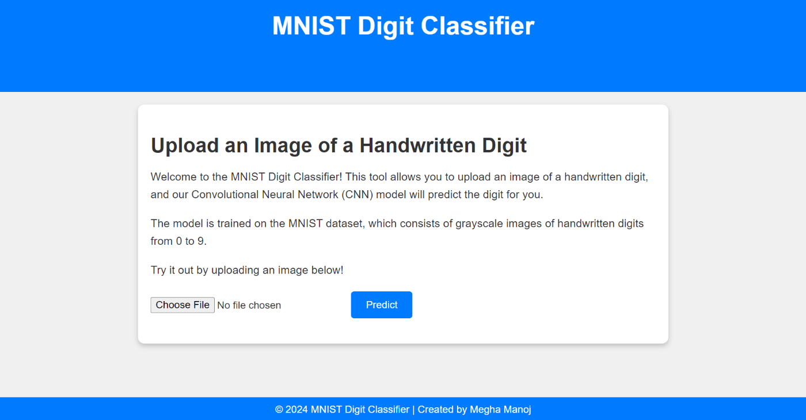
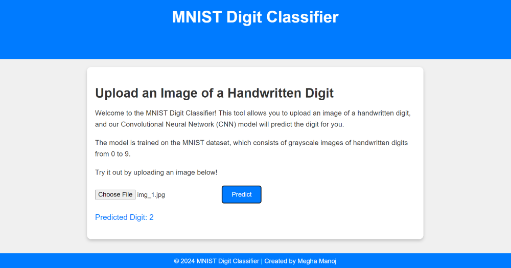

# MNIST Digit Classifier-CNN 🧑‍💻✨

Welcome to the **MNIST Digit Classifier**! 🎉 This project combines machine learning and web development to create a web application that classifies handwritten digits from the MNIST dataset. Whether you're a data science enthusiast, a machine learning newbie, or just curious, you can test out this cool web app to see how well a neural network can recognize digits. 


## 🧩 Project Overview

### 🧠 Machine Learning Model

At the heart of this application is a Convolutional Neural Network (CNN) designed to recognize handwritten digits. Here's a quick rundown of the model:

- **Architecture:** SimpleCNN
- **Layers:** 
  - 2 Convolutional Layers
  - 2 ReLU Activations
  - 2 MaxPooling Layers
  - 1 Fully Connected Layer
  - **Output:** 10 classes (digits 0-9)
- **Dataset:** MNIST
- **Frameworks:** PyTorch

### 🌐 Web Application

The web app provides a user-friendly interface for uploading images and receiving predictions. It’s built with Flask and features:

- **Frontend:** HTML, CSS, and JavaScript
- **Backend:** Python Flask, integrated with the PyTorch model

## 📜 How It Works

1. **Upload an Image:** Select a file containing a handwritten digit.
2. **Model Prediction:** The image is processed, transformed into a tensor, and passed through the CNN model.
3. **Result Display:** The app returns the predicted digit based on the model’s output.

## 📂 Project Structure

Here's an overview of the project files and their roles:

- `app.py`: The Flask application code that handles image uploads and communicates with the ML model.
- `model.py`: Defines the `SimpleCNN` model architecture used for digit classification.
- `static/`: Contains CSS and JavaScript files for the web app.
- `templates/`: HTML files for the web app's frontend.
- `.vercelignore`: Specifies files and directories to ignore during deployment.
- `requirements.txt`: Lists the Python packages required for the app.
- `Procfile`: Instructions for the web server to run the Flask app.

## 📦 Installation

To get this project up and running on your local machine:

1. **Clone the repository:**

    ```bash
    git clone https://github.com/your-username/MNIST-Digit-Classifier.git
    cd MNIST-Digit-Classifier
    ```

2. **Create a virtual environment and activate it:**

    ```bash
    python -m venv venv
    venv\Scripts\activate  # For Windows
    source venv/bin/activate  # For macOS/Linux
    ```

3. **Install dependencies:**

    ```bash
    pip install -r requirements.txt
    ```

4. **Run the Flask app:**

    ```bash
    python app.py
    ```

5. **Open your browser and go to:** [http://localhost:5000](http://localhost:5000)

## 🎯 Contributing

Want to contribute? Great! Open an issue or create a pull request. Contributions, feedback, and suggestions are always welcome! 🙌

## 📝 License

This project is licensed under the MIT License. See the [LICENSE](LICENSE) file for details.


## 📷 Screenshots

Here are some screenshots of the application in action:




